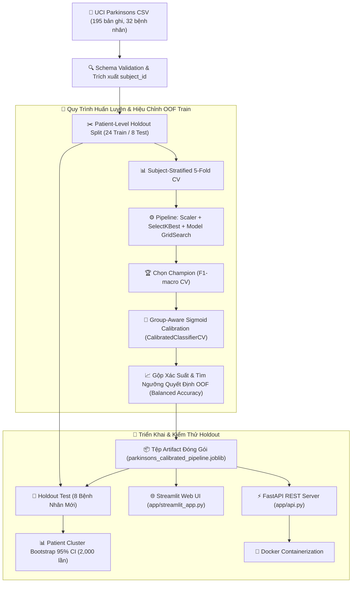
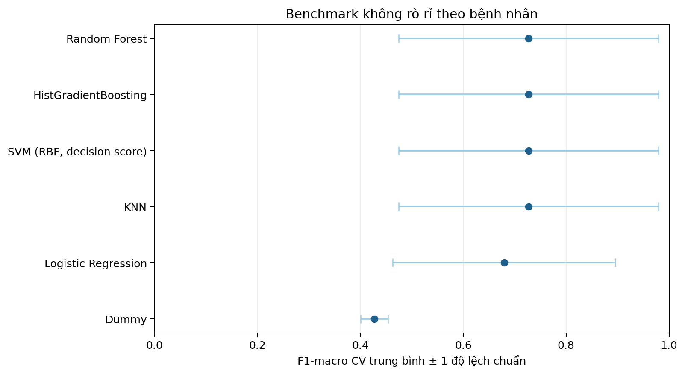
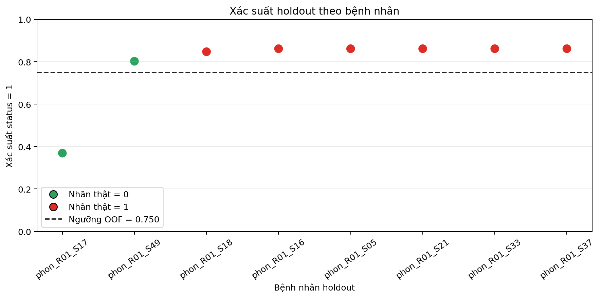
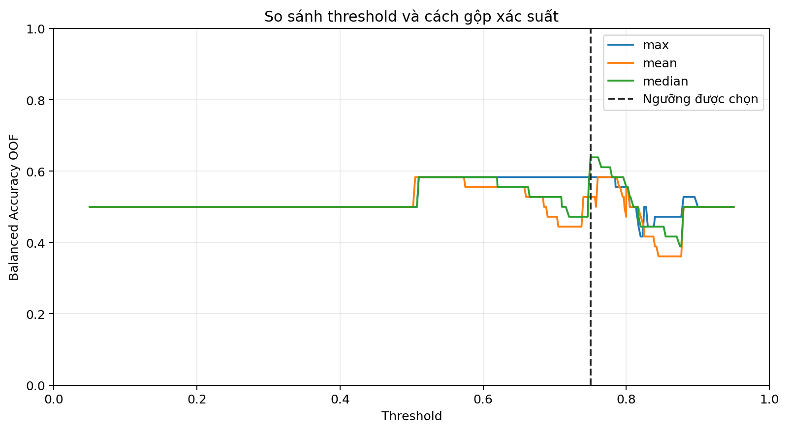
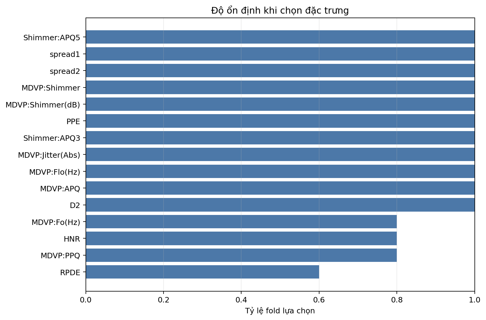

# 🎙️ Leakage-Aware Parkinson’s Voice Classification

> **Research prototype:** Phân loại `status` từ các đặc trưng âm học đã trích xuất, tập trung vào kiểm toán rò rỉ dữ liệu và đánh giá trên bệnh nhân chưa xuất hiện trong train.

[](https://github.com/haminhthong/parkinsons-voice-classification/actions/workflows/ci.yml)
[](https://www.python.org/)
[](https://scikit-learn.org/)
[](https://fastapi.tiangolo.com/)
[](https://streamlit.io/)
[](https://www.docker.com/)

---

## 🎯 Điểm Nổi Bật Dành Cho CV / Portfolio

> **Phạm vi đầu vào:** Ứng dụng không nhận WAV/MP3 và không tự trích xuất tín hiệu âm thanh. Input là CSV chứa `name` cùng 22 đặc trưng âm học theo schema UCI Parkinsons.

- **Patient-Level Independent Evaluation**: Phân chia holdout, outer CV và inner CV theo bệnh nhân (`subject_id`), kèm assertion kiểm tra overlap.
- **Nested Group-Aware Sigmoid Calibration**: Hiệu chỉnh xác suất bằng `CalibratedClassifierCV` trên các fold không trùng bệnh nhân; chất lượng xác suất được mô tả bằng Brier Score và ECE.
- **Zero-Leakage OOF Rule Optimization**: Khóa toàn bộ quy tắc gộp xác suất bản ghi (`max`/`mean`/`median`) và ngưỡng quyết định (`decision_threshold`) hoàn toàn từ Out-Of-Fold (OOF) Train.
- **Statistical Uncertainty Estimation**: Sử dụng thuật toán **Patient Cluster Bootstrap 2,000 lần** để tính Khoảng Tin Cậy 95% (95% CI) cho tất cả các chỉ số hiệu năng.
- **Deployment-Oriented Prototype**: Có CLI training, FastAPI, Streamlit, Docker và GitHub Actions; chưa được xác nhận cho triển khai lâm sàng hoặc production có dữ liệu thật.

---

## 📖 Câu Chuyện Dự Án & Vấn Đề Rò Rỉ Dữ Liệu (Data Leakage)

### 🔴 Phương Pháp Ngây Thơ (Naive Split): Accuracy lạc quan 92.31%
Trong hầu hết các bài báo và notebook minh họa trên bộ dữ liệu [UCI Parkinsons](https://archive.ics.uci.edu/dataset/174/parkinsons), dữ liệu gồm 195 bản ghi âm từ 32 bệnh nhân (mỗi bệnh nhân thực hiện 5-6 lần ghi âm giọng nói). 

Khi sử dụng hàm `train_test_split` ngẫu nhiên mặc định trên từng dòng ghi âm:
1. Với Random Forest, `test_size=0.2` và `random_state=42`, mô hình đạt Accuracy **92.31%**.
2. Audit tái lập trong `src/audit.py` phát hiện **24/24 bệnh nhân (100%) trong test cũng xuất hiện trong train** qua các bản ghi khác.
3. **Hậu quả:** Kết quả record-level split không cung cấp ước lượng đáng tin cậy cho bệnh nhân mới, vì mô hình có thể khai thác đặc điểm riêng của người nói. Thí nghiệm này không chứng minh trực tiếp mô hình đã học danh tính hoặc chắc chắn thất bại trên mọi cohort khác.

### 🟢 Phương Pháp Chống Rò Rỉ (Leakage-Aware Pipeline)
Repository này tái cấu trúc lại toàn bộ quy trình xử lý và đánh giá:
1. **Tạo bảng đại diện bệnh nhân**: Gom nhóm 195 bản ghi âm thành 32 đối tượng bệnh nhân duy nhất (`subject_id`).
2. **Chia Holdout theo bệnh nhân**: Phân chia 24 bệnh nhân cho Train/Validation và 8 bệnh nhân cho Holdout Test độc lập (có phân tầng nhãn Stratified).
3. **Ánh xạ bản ghi ngược lại**: Ánh xạ danh sách `subject_id` trở lại các dòng dữ liệu ghi âm tương ứng.
4. **Đóng gói Pipeline**: Đặt `StandardScaler` và `SelectKBest` bên trong scikit-learn `Pipeline`, đảm bảo bước tính mean/std chỉ diễn ra trên train fold của từng lượt CV.
5. **Đánh giá mức bệnh nhân**: Báo cáo đầy đủ chỉ số hiệu năng ở mức bệnh nhân kèm khoảng tin cậy 95% CI.

---

## 🏗️ Kiến Trúc Đánh Giá & Triển Khai End-to-End



---

<!-- GENERATED_RESULTS_START -->

### Bảng So Sánh Benchmark Mô Hình (Subject-Level Cross-Validation)

| Model | Subject F1-macro mean | Subject F1-macro std | Subject Balanced Accuracy mean | Subject ROC-AUC mean |
| :--- | :---: | :---: | :---: | :---: |
| KNN | 0.7270 | 0.2527 | 0.7500 | 0.9000 |
| SVM (RBF, decision score) | 0.7270 | 0.2527 | 0.7500 | 0.6833 |
| Random Forest | 0.7270 | 0.2527 | 0.7500 | 0.6000 |
| HistGradientBoosting | 0.7270 | 0.2527 | 0.7500 | 0.5000 |
| Logistic Regression | 0.6794 | 0.2166 | 0.7250 | 0.7000 |
| Dummy | 0.4274 | 0.0269 | 0.5000 | 0.4750 |

### Kết Quả Đánh Giá Tổng Thể Pipeline

- **Mô hình Champion**: `KNN + sigmoid calibration`
- **Quy tắc gộp xác suất**: `median`
- **Ngưỡng quyết định**: `0.7500`

#### Nested Subject-Level Cross-Validation:
- **Subject F1-macro mean**: `0.5190` (std: `0.3283`)
- **Subject Balanced Accuracy mean**: `0.6083`
- **Subject ROC-AUC mean**: `0.6333`

#### Holdout Patient Test Set:
- **F1-macro**: `0.7949`
- **Balanced Accuracy**: `0.7500`
- **Recall/Sensitivity**: `1.0000`
- **Specificity**: `0.5000`
- **ROC-AUC**: `1.0000`
- **ECE (5 bins)**: `0.0513`

<!-- GENERATED_RESULTS_END -->

---

## 📈 Biểu Đồ Trực Quan Hóa Báo Cáo

Các biểu đồ bên dưới được tự động tạo bởi module `src/report.py` và lưu trữ trong `reports/figures/`:

<p align="center">
  
  
</p>

<p align="center">
  
  
</p>

---

## 🛠️ Công Nghệ Sử Dụng

- **Ngôn ngữ & Học máy:** Python 3.10+, pandas, NumPy, scikit-learn, joblib.
- **Đánh giá Thống kê:** Patient Stratified K-Fold, Group OOF Calibration, Brier Score, ECE, Patient Cluster Bootstrap CI.
- **Ứng dụng & API:** Streamlit (Web Dashboard), FastAPI & Uvicorn (REST API).
- **Kiểm thử & Chất lượng mã:** pytest, Ruff, Type Hinting, GitHub Actions CI.
- **Đóng gói Docker:** Multi-stage build Dockerfile chạy với Non-root user và Healthcheck.

---

## 🛠️ Những Lỗi Kỹ Thuật Đã Sửa (Audit Log)

| Vấn Đề Kỹ Thuật Ban Đầu | Cách Xử Lý Chi Tiết Trong Dự Án |
|---|---|
| Chia ngẫu nhiên 195 bản ghi ghi âm | Gom nhóm theo 32 `subject_id`, chia tập dữ liệu ở cấp độ bệnh nhân |
| Validation Fold thiếu lớp nhãn | Dùng `StratifiedKFold` trên danh sách bệnh nhân duy nhất |
| Scaler học trước khi chia fold | Đóng gói `StandardScaler` vào `Pipeline` chỉ fit trên Train Fold |
| Xác suất dự đoán chưa được hiệu chỉnh | Áp dụng Sigmoid Calibration lồng nhóm bệnh nhân (`CalibratedClassifierCV`) |
| Chọn ngưỡng quyết định trên Test Set | Quét ngưỡng quyết định tối ưu hoàn toàn từ OOF Train |
| Báo cáo điểm số đơn lẻ (Point Estimate) | Ước lượng khoảng tin cậy 95% CI bằng Patient Cluster Bootstrap 2,000 lần |
| Rò rỉ thông qua đặc trưng dư thừa | Loại bỏ `Jitter:DDP` và `Shimmer:DDA` ngay ở bước tiền xử lý |

---

## 🚀 Hướng Dẫn Cài Đặt & Sử Dụng

### 1. Cài Đặt Môi Trường
```bash
# Clone repository
git clone https://github.com/haminhthong/parkinsons-voice-classification.git
cd parkinsons-voice-classification

# Tạo môi trường ảo Python
python -m venv .venv
# Trên Windows:
.venv\Scripts\activate
# Trên Linux/macOS:
source .venv/bin/activate

# Cài đặt các thư viện phụ thuộc
pip install -r requirements.txt
```

### 2. Huấn Luyện Mô Hình & Sinh Báo Cáo
```bash
# Huấn luyện benchmark, hiệu chỉnh mô hình và xuất artifact
python -m src.train --data data/parkinsons.csv --artifacts artifacts

# Sinh 4 biểu đồ báo cáo trong reports/figures/
python -m src.report --artifacts artifacts --output reports/figures
```

### 3. Chạy Ứng Dụng Streamlit Web Demo
```bash
streamlit run app/streamlit_app.py
```
*Truy cập giao diện tại: `http://localhost:8501`*

### 4. Chạy REST API Server Với FastAPI
```bash
uvicorn app.api:app --reload --port 8000
```
*Kiểm tra API docs Swagger tại: `http://localhost:8000/docs`*

Gửi yêu cầu dự đoán qua cURL:
```bash
curl -X POST "http://localhost:8000/predict" -F "file=@data/parkinsons.csv"
```

### 5. Chạy Với Docker Container
```bash
# Build Docker image
docker build -t parkinson-voice-app .

# Chạy container Streamlit demo
docker run -d -p 8501:8501 --name parkinson_demo parkinson-voice-app
```

### 6. Chạy Kiểm Thử Tự Động (Unit Tests)
```bash
python -m pytest
```

---

## 💡 Điểm Nhấn Phỏng Vấn (CV Highlights)

Nếu bạn đưa dự án này vào CV cho vị trí **Data Scientist / Machine Learning Engineer**, đây là 4 câu chuyện kỹ thuật cốt lõi giúp bạn ghi điểm:

1. **"Tại sao Accuracy 92.31% vẫn có thể gây hiểu nhầm?"** -> Trình bày audit cho thấy 24/24 bệnh nhân test bị trùng với train khi chia theo bản ghi.
2. **"Làm sao để đảm bảo mô hình không nhìn thấy tập Test?"** -> Trình bày kiến trúc `subject_holdout_split` và cách tìm ngưỡng decision threshold hoàn toàn từ Out-Of-Fold (OOF).
3. **"Xác suất của mô hình có đáng tin cậy không?"** -> Trình bày `Group-Aware Sigmoid Calibration`, Brier Score và ECE, đồng thời nêu rõ calibration trên mẫu nhỏ chưa phải xác suất nguy cơ lâm sàng.
4. **"Dữ liệu nhỏ có đáng tin không?"** -> Chứng minh tư duy thống kê qua thuật toán `Patient Cluster Bootstrap 95% CI`.

---

## 📜 Giấy Phép & Tuyên Bố Miễn Trách Nhiệm

- **Giấy phép:** MIT License - xem file [LICENSE](LICENSE) để biết thêm chi tiết.
- **Tuyên bố y tế:** Dự án này chỉ phục vụ mục đích nghiên cứu học thuật. Mô hình học máy không phải là thiết bị y tế và không được dùng để thay thế cho chẩn đoán của bác sĩ chuyên khoa.
