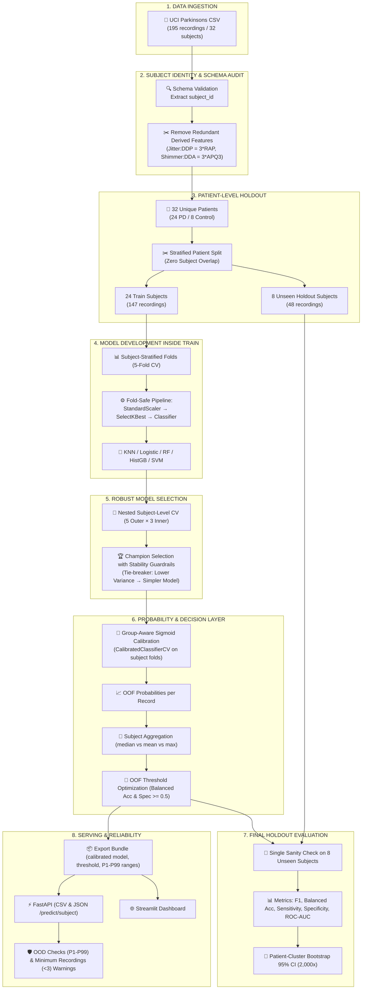

# 🎙️ Parkinson’s Voice Feature Screening — Leakage-Aware Patient-Level ML Prototype

> **Research Prototype:** Hệ thống học máy độc lập cấp bệnh nhân phục vụ nghiên cứu sàng lọc Parkinson từ 22 đặc trưng âm học đã trích xuất sẵn, kết hợp kiểm định lồng (Nested Subject-Level CV), hiệu chỉnh xác suất theo nhóm (Group-Aware Calibration), tối ưu hóa ngưỡng quyết định Out-of-Fold (OOF) và ước lượng độ bất định bằng Patient-Cluster Bootstrap 95% CI.

[](https://github.com/haminhthong/parkinsons-voice-classification/actions/workflows/ci.yml)
[](https://www.python.org/)
[](https://scikit-learn.org/)
[](https://fastapi.tiangolo.com/)
[](https://streamlit.io/)
[](https://www.docker.com/)

---

## 🎯 Điểm Nổi Bật Dành Cho CV / Portfolio

> [!IMPORTANT]
> **Phạm vi đầu vào & Định vị sản phẩm:**
> - Hệ thống hiện **chỉ tiếp nhận bảng 22 đặc trưng âm học số** đã được trích xuất sẵn từ nguyên âm kéo dài `/a/` (theo schema UCI Parkinsons).
> - Hệ thống **KHÔNG nhận file âm thanh thô (WAV, MP3)** và không tự động xử lý tín hiệu âm thanh thô. Vì vậy, dự án được định vị chính xác là **Parkinson’s Voice Feature Screening Prototype**, chưa phải hệ thống phân tích giọng nói end-to-end.
> - Kết quả đầu ra là **cờ sàng lọc nghiên cứu** (`screening_score`, `model-positive`, `model-negative`), **hoàn toàn không phải kết luận chẩn đoán y khoa**.

- **Patient-Level Independent Split (Zero Subject Leakage):** Phân chia holdout, outer CV và inner CV hoàn toàn theo danh tính bệnh nhân (`subject_id`), đảm bảo mọi bản ghi của cùng một người chỉ thuộc về duy nhất một tập phân chia.
- **Three-Layer Evaluation Strategy:** Tách bạch 3 tầng đánh giá: (1) Inner Model Search, (2) Nested Subject-Level CV để ước lượng độ bất định của toàn bộ quy trình lựa chọn mô hình, và (3) Unseen Patient Holdout.
- **Honest Generalization Framing:** Không headline bằng con số ngây thơ 92.31% hay điểm số Holdout 8 bệnh nhân ($ROC\text{-}AUC = 1.0$). Nhấn mạnh phân phối **Nested Cross-Validation ($F_1\text{-macro} = 0.519 \pm 0.328$)** và khoảng tin cậy **Patient-Cluster Bootstrap 95% CI** như thước đo bảo thủ và đáng tin cậy nhất.
- **Group-Aware Sigmoid Calibration:** Hiệu chỉnh xác suất bằng `CalibratedClassifierCV` trên các fold chia theo bệnh nhân, ngăn ngừa bản ghi của cùng một người xuất hiện đồng thời ở bước fit và bước calibration.
- **Zero-Leakage OOF Rule Optimization:** Khóa toàn bộ quy tắc gộp xác suất (`median`) và ngưỡng quyết định (`decision_threshold`) hoàn toàn từ Out-Of-Fold (OOF) Train với ràng buộc Specificity tối thiểu.
- **Serving Reliability Guardrails:** Runtime tích hợp kiểm tra Out-of-Distribution (OOD dải P1–P99 của tập huấn luyện), cảnh báo khi đối tượng có ít hơn 3 bản ghi âm (`ONLY_ONE_RECORDING`), hỗ trợ endpoint JSON theo cấp bệnh nhân và chặn nhận nhãn huấn luyện (`status`).

---

## 🏥 Ranh Giới Lâm Sàng (Clinical Boundary & Intended Use)

- **Mục đích sử dụng (Intended Use):** Phục vụ mục đích học thuật, nghiên cứu phương pháp luận kiểm toán rò rỉ dữ liệu (data leakage audit) trên dữ liệu y sinh dạng bảng có cấu trúc nhóm.
- **Không phục vụ chẩn đoán (Not for Diagnosis):** Mô hình không phải thiết bị y tế (medical device), không được chứng nhận FDA/CE-MDR và không được sử dụng để đưa ra chỉ định điều trị hoặc thay thế khám chuyên khoa thần kinh.
- **Chuẩn hóa thuật ngữ:** 
  - Thay vì "Parkinson's diagnosed", hệ thống xuất: `model-positive` (vượt ngưỡng sàng lọc), `model-negative` (dưới ngưỡng sàng lọc) và điểm nguy cơ sàng lọc `screening_score`.

---

## 📖 Câu Chuyện Dự Án: Cạm Bẫy Rò Rỉ Bản Ghi (The 92.31% Leakage Trap)

### 🔴 Tại sao đánh giá ngây thơ (Naive Split) đạt 92.31% nhưng gây hiểu nhầm?
Bộ dữ liệu [UCI Parkinsons](https://archive.ics.uci.edu/dataset/174/parkinsons) gồm 195 bản ghi âm từ **32 bệnh nhân** (mỗi bệnh nhân thực hiện 5–6 lần phát âm nguyên âm `/a/`).

Khi sử dụng hàm `train_test_split` ngẫu nhiên thông thường trên từng dòng bản ghi:
1. Mô hình Random Forest (`test_size=0.2`, `random_state=42`) dễ dàng đạt Accuracy **92.31%**.
2. **Bản chất của audit (`src/audit.py`):** Kiểm tra đối chiếu phát hiện **24/24 bệnh nhân (100%) trong tập test đều đã xuất hiện trong tập train** qua các bản ghi âm khác.
3. **Hậu quả:** Mô hình ghi nhớ đặc trưng âm học riêng biệt của từng cá nhân (speaker acoustic identity) thay vì học các đặc trưng bệnh lý Parkinson tổng quát. Khi gặp bệnh nhân hoàn toàn mới ngoài đời thực, mô hình sẽ suy giảm hiệu năng nghiêm trọng.

```
❌ Naive Record Split (LEAKAGE):
Patient A ──┬── recording 1 ──> [TRAIN]
            ├── recording 2 ──> [TEST]  <-- Rò rỉ danh tính người nói!
            └── recording 3 ──> [TRAIN]

✅ Patient-Level Split (ZERO LEAKAGE):
Patient A ──┬── recording 1 ┐
            ├── recording 2 ├──> [TRAIN ONLY] (Toàn bộ bản ghi của A ở Train)
            └── recording 3 ┘
Patient B ──┬── recording 1 ┐
            ├── recording 2 ├──> [HOLDOUT ONLY] (Chưa từng xuất hiện ở Train)
            └── recording 3 ┘
```

---

## 🏗️ Kiến Trúc Chuẩn 8 Giai Đoạn (Canonical 8-Stage Pipeline)

Toàn bộ repository tuân thủ chặt chẽ quy trình chuẩn 8 giai đoạn:



---

## 🔬 Dữ Liệu & Kiểm Toán Đặc Trưng (Dataset & Feature Audit)

- **Bộ dữ liệu:** UCI Parkinsons gồm 195 bản ghi âm đo đạc từ 32 cá nhân (24 người bệnh Parkinson, 8 người đối chứng khỏe mạnh).
- **Loại bỏ đặc trưng dẫn xuất dư thừa toán học:**
  - `Jitter:DDP` $= 3 \times \text{MDVP:RAP}$
  - `Shimmer:DDA` $= 3 \times \text{Shimmer:APQ3}$
  - **Lưu ý kỹ thuật P0:** Hai đặc trưng này bị loại bỏ vì có **quan hệ đại số tất định** làm nhân đôi trọng số thông tin một cách không cần thiết, **không phải do data leakage**. Sau khi lọc, còn 20 đặc trưng số độc lập đưa vào huấn luyện.

---

## ⚖️ Chiến Lược Đánh Giá 3 Tầng (Three Evaluation Layers)

Để tránh nhầm lẫn giữa các bảng metric, quy trình đánh giá được phân định thành 3 tầng độc lập:

1. **Layer 1: Inner Model Search:** Quét lưới siêu tham số và so sánh sơ bộ các thuật toán trên các fold CV của tập Train.
2. **Layer 2: Nested Cross-Validation (Đánh giá quy trình):** Đánh giá toàn bộ pipeline lựa chọn mô hình qua 5 outer folds $\times$ 3 inner folds. Đây là thước đo trung thực nhất về độ bất định khi tổng quát hóa sang tập bệnh nhân mới.
3. **Layer 3: Independent Patient Holdout (Kiểm tra độc lập cuối cùng):** Kiểm thử mô hình đã đóng băng duy nhất 1 lần trên 8 bệnh nhân chưa từng xuất hiện.

---

<!-- GENERATED_RESULTS_START -->

## 📊 Kết Quả Thực Nghiệm & Đánh Giá Chi Tiết

### 1. Bảng So Sánh Benchmark Mô Hình (Subject-Level Cross-Validation)

| Model | Subject F1-macro mean | Subject F1-macro std | Subject Balanced Accuracy mean | Subject ROC-AUC mean |
| :--- | :---: | :---: | :---: | :---: |
| **KNN** | **0.7270** | **0.2527** | **0.7500** | **0.9000** |
| SVM (RBF, decision score) | 0.7270 | 0.2527 | 0.7500 | 0.6833 |
| Random Forest | 0.7270 | 0.2527 | 0.7500 | 0.6000 |
| HistGradientBoosting | 0.7270 | 0.2527 | 0.7500 | 0.5000 |
| Logistic Regression | 0.6794 | 0.2166 | 0.7250 | 0.7000 |
| Dummy Classifier | 0.4274 | 0.0269 | 0.5000 | 0.4750 |

> [!NOTE]
> **Giải thích hiện tượng hòa điểm ($F_1 \approx 0.7270$):**
> Do tập train chỉ có 24 bệnh nhân (với 6 bệnh nhân đối chứng), các metric ở cấp bệnh nhân có độ phân giải thô. KNN, SVM, RF và HistGB đều cho cùng $F_1$ trung bình trên các fold. 
> KNN được chọn làm Champion thông qua **Stability & Simplicity Guardrail**: khi điểm $F_1$ hòa nhau, hệ thống ưu tiên phương sai thấp hơn, điểm phân tách ROC-AUC cao hơn (0.9000) và cấu trúc thuật toán đơn giản hơn để tránh overfit.

---

### 2. So Sánh Quy Tắc Gộp Xác Suất Trên OOF Train

| Phương Pháp Gộp | Ngưỡng Tối Ưu | Balanced Accuracy | F1-macro | Specificity | Brier Score |
| :--- | :---: | :---: | :---: | :---: | :---: |
| **median** (Champion) | **0.7500** | **0.6944** | **0.6794** | **0.5000** | **0.2185** |
| mean | 0.7600 | 0.6667 | 0.6489 | 0.5000 | 0.2214 |
| max | 0.8800 | 0.6389 | 0.6286 | 0.5000 | 0.2301 |

- `mean`: Đo lường mức rủi ro trung bình qua các lần phát âm.
- `median`: **Chiến thắng** nhờ tính bền vững (robustness), loại bỏ ảnh hưởng của các bản ghi phát âm dị biệt (outlier recordings).
- `max`: Chiến lược quá bảo thủ, dễ bị kích hoạt báo động giả chỉ bởi 1 lần phát âm lỗi.

---

### 3. Đánh Giá Lồng Nested CV vs Kiểm Thử Holdout 8 Bệnh Nhân

| Chỉ Số Đánh Giá | Nested Subject CV (24 Bệnh Nhân Train) | Holdout Point Estimate (8 Bệnh Nhân Unseen) | Patient-Cluster Bootstrap 95% CI (Holdout) |
| :--- | :---: | :---: | :---: |
| **F1-macro** | `0.5190 ± 0.3283` | `0.7949` | **[0.3846, 1.0000]** |
| **Balanced Accuracy** | `0.6083` | `0.7500` | **[0.5000, 1.0000]** |
| **Sensitivity (Recall)** | `0.6444` | `1.0000` | **[1.0000, 1.0000]** |
| **Specificity** | `0.5722` | `0.5000` | **[0.0000, 1.0000]** |
| **ROC-AUC** | `0.6333` | `1.0000` | **[1.0000, 1.0000]** |
| **Brier Score** | `0.1893` | `0.1124` | **[0.0338, 0.2686]** |
| **ECE (5 bins)** | — | `0.0513` *(chỉ mang tính mô tả)* | — |

> [!WARNING]
> **Nhận định quan trọng về sự chênh lệch giữa Nested CV và Holdout:**
> 1. **Holdout 8 bệnh nhân là cực kỳ nhỏ:** Tập test chỉ có 6 bệnh nhân Parkinson và **2 người khỏe mạnh**. Điểm số Specificity = 0.50 thực chất tương ứng với việc đoán đúng **1 trong số 2 người**.
> 2. **ROC-AUC = 1.00 không phải bằng chứng tuyệt đối:** Con số này chỉ phản ánh sự phân tách trên đúng 8 đối tượng này.
> 3. **Nested CV phản ánh thực tế hơn:** Nested CV đạt $F_1 = 0.519 \pm 0.328$ với độ lệch chuẩn lớn, chứng minh hiệu năng rất nhạy cảm với cách phân nhóm bệnh nhân nhỏ. Đây là đặc tính thống kê tự nhiên của bài toán, không phải lỗi code.
> 4. **Bootstrap CI rộng:** Khoảng tin cậy $F_1$ từ `[0.385, 1.000]` và Specificity từ `[0.000, 1.000]` phơi bày toàn bộ độ bất định thống kê mà điểm số đơn lẻ (point estimate) che giấu.

<!-- GENERATED_RESULTS_END -->

---

## 📈 Biểu Đồ Trực Quan Hóa Báo Cáo

Các biểu đồ bên dưới được sinh tự động bởi module `src/report.py` và lưu trữ trong `reports/figures/`:

<p align="center">
  
  
</p>

<p align="center">
  
  
</p>

---

## 🔍 Độ Ổn Định Lựa Chọn Đặc Trưng (Feature Stability)

| Đặc trưng âm học | Số fold CV lựa chọn (trên 5 fold) | Tần suất xuất hiện |
| :--- | :---: | :---: |
| `PPE` | 5 / 5 | 100% |
| `spread1` | 5 / 5 | 100% |
| `MDVP:Fo(Hz)` | 5 / 5 | 100% |
| `MDVP:Flo(Hz)` | 5 / 5 | 100% |
| `MDVP:Shimmer` | 5 / 5 | 100% |
| `Shimmer:APQ5` | 5 / 5 | 100% |
| `MDVP:APQ` | 5 / 5 | 100% |
| `HNR` | 5 / 5 | 100% |
| `MDVP:Fhi(Hz)` | 4 / 5 | 80% |
| `spread2` | 4 / 5 | 80% |

> [!NOTE]
> **Lưu ý giải thích:** Việc một số đặc trưng không được chọn 100% qua các fold thể hiện sự bất định do kích thước mẫu nhỏ, **không mang ý nghĩa kết luận cơ chế nhân quả sinh học**.

---

## 🛡️ Kiến Trúc Phục Vụ Suy Luận (Serving & Guardrails)

Hệ thống serving cung cấp 2 phương thức giao tiếp REST API qua FastAPI:

```
                  ┌──────────────────────────────────────────────┐
                  │ POST /predict (CSV) or /predict/subject (JSON)│
                  └──────────────────────┬───────────────────────┘
                                         │
                              Pydantic Schema Validation
                              (Chặn nhãn status, extra="forbid")
                                         │
                                         ▼
                  ┌──────────────────────────────────────────────┐
                  │ Runtime Reliability & OOD Checks             │
                  │ 1. Giá trị ngoài dải P1-P99 tập train?       │
                  │ 2. Số lượng bản ghi < 3 recordings?          │
                  └──────────────────────┬───────────────────────┘
                                         │
                                         ▼
                  ┌──────────────────────────────────────────────┐
                  │ Recording Inference & Median Aggregation     │
                  │ Calibrated KNN + OOF Decision Threshold      │
                  └──────────────────────┬───────────────────────┘
                                         │
                                         ▼
                  ┌──────────────────────────────────────────────┐
                  │ Response JSON                                │
                  │ screening_score, screening_flag,             │
                  │ reliability ("standard" | "limited"),        │
                  │ warnings: ["ONLY_ONE_RECORDING", ...]        │
                  └──────────────────────────────────────────────┘
```

### 1. Endpoint JSON theo cấp bệnh nhân: `POST /predict/subject`
Yêu cầu mẫu:
```bash
curl -X POST "http://localhost:8000/predict/subject" \
     -H "Content-Type: application/json" \
     -d '{
       "subject_id": "patient_101",
       "recordings": [
         {
           "MDVP:Fo(Hz)": 119.992,
           "MDVP:Fhi(Hz)": 157.302,
           "MDVP:Flo(Hz)": 74.997,
           "MDVP:Jitter(%)": 0.00784,
           "MDVP:Jitter(Abs)": 0.00007,
           "MDVP:RAP": 0.00370,
           "MDVP:PPQ": 0.00554,
           "MDVP:Shimmer": 0.04374,
           "MDVP:Shimmer(dB)": 0.426,
           "Shimmer:APQ3": 0.02182,
           "Shimmer:APQ5": 0.03130,
           "MDVP:APQ": 0.02971,
           "NHR": 0.02211,
           "HNR": 21.033,
           "RPDE": 0.414783,
           "DFA": 0.815285,
           "spread1": -4.813031,
           "spread2": 0.266482,
           "D2": 2.301442,
           "PPE": 0.284654
         }
       ]
     }'
```

Phản hồi mẫu:
```json
{
  "warning": "KẾT QUẢ NGHIÊN CỨU: Mô hình phân loại giọng nói Parkinson là bản thử nghiệm học thuật, không dùng để chẩn đoán, điều trị hay thay thế bác sĩ.",
  "model": "KNN + sigmoid calibration",
  "subject_id": "patient_101",
  "screening_score": 0.814,
  "screening_flag": true,
  "reliability": "limited",
  "warnings": [
    "ONLY_ONE_RECORDING: Đối tượng chỉ có 1 bản ghi âm; độ tin cậy gộp xác suất bị hạn chế (khuyến nghị >= 3 bản ghi)"
  ],
  "aggregation": "median",
  "decision_threshold": 0.75,
  "n_recordings": 1,
  "record_probabilities": [0.814]
}
```

### 2. Endpoint tải lên file CSV: `POST /predict`
```bash
curl -X POST "http://localhost:8000/predict" -F "file=@data/parkinsons.csv"
```

---

## 🚀 Hướng Dẫn Cài Đặt & Chạy Thử Nghiệm

### 1. Khởi tạo môi trường ảo
```bash
git clone https://github.com/haminhthong/parkinsons-voice-classification.git
cd parkinsons-voice-classification

python -m venv .venv
# Kích hoạt trên Windows:
.venv\Scripts\activate
# Kích hoạt trên Linux/macOS:
source .venv/bin/activate

pip install -r requirements.txt
```

### 2. Huấn luyện toàn bộ pipeline & sinh artifact
```bash
python -m src.train --data data/parkinsons.csv --artifacts artifacts
python -m src.report --artifacts artifacts --output reports/figures
```

### 3. Khởi chạy ứng dụng Web Demo (Streamlit)
```bash
streamlit run app/streamlit_app.py
```
*Truy cập tại: `http://localhost:8501`*

### 4. Khởi chạy REST API Server (FastAPI)
```bash
uvicorn app.api:app --reload --port 8000
```
*Tài liệu Swagger API tại: `http://localhost:8000/docs`*

### 5. Chạy toàn bộ kiểm thử tự động (Unit Tests)
```bash
python -m pytest
```

---

## ⚠️ Giới Hạn Nghiên Cứu & Nợ Kỹ Thuật (Limitations)

1. **Cỡ mẫu nhỏ (32 bệnh nhân):** Chỉ có 8 đối chứng khỏe mạnh trong toàn bộ tập dữ liệu, dẫn đến phương sai ước lượng lớn.
2. **Holdout chỉ có 8 người:** Specificity và ROC-AUC phụ thuộc vào số lượng cá nhân quá ít; bắt buộc phải đọc kèm Nested CV và Bootstrap CI.
3. **Thiếu biến số nhân khẩu học:** Dữ liệu UCI không chứa tuổi (age), giới tính sinh học (sex), thiết bị thu âm và bệnh viện thu thập, do đó không thể phân tích độ ổn định theo nhóm nhân khẩu học.
4. **Định dạng lưu trữ Joblib:** Joblib phù hợp với môi trường portfolio cá nhân; trong môi trường production bảo mật cao, cần chuyển sang format an toàn như `skops` hoặc `ONNX` để ngăn rủi ro thực thi mã tùy ý.

---

## 🗺️ Lộ Trình Phát Triển Tương Lai (Future Roadmap)

### P1 / P2: Mở rộng xử lý Audio thô (Raw-Audio Pipeline)
- Tích hợp các tập dữ liệu giọng nói thô có cấp phép (như PC-GITA, mPower, Italian Parkinson's Speech).
- Xây dựng quy trình:
  $$\text{Raw WAV} \xrightarrow{\text{Audio QC + VAD}} \text{Voice Activity Detection} \xrightarrow{\text{Praat / librosa}} \text{Acoustic Extraction (F0, Jitter, MFCC)} \xrightarrow{\text{Classifier}}$$
- Thử nghiệm các kiến trúc Self-Supervised Speech Embeddings tiền huấn luyện: `wav2vec 2.0`, `HuBERT`, `WavLM`.
- **Bất biến cốt lõi (Core Invariant):** Mọi thí nghiệm âm thanh thô đều phải bảo toàn nguyên tắc **phân chia độc lập theo cấp bệnh nhân (Patient-Level Split)**.

### P2 / P3: Kiểm định ngoại viện (External Multi-Site Validation)
- Đánh giá mô hình huấn luyện trên cohort A đối với cohort B nhằm kiểm tra độ dịch chuyển phân phối (domain shift).
- Nghiên cứu độ ổn định của các đặc trưng âm học trước sự thay đổi của micro thu âm và môi trường tạp âm phòng khám.

---

## 📜 Giấy Phép & Miễn Trừ Trách Nhiệm

- **Giấy phép mã nguồn:** MIT License - xem tệp [LICENSE](LICENSE).
- **Tuyên bố y tế:** Dự án này là công trình nghiên cứu học máy mang tính học thuật. Phần mềm không phải là thiết bị y tế và không được dùng để thay thế cho chẩn đoán hay lời khuyên của chuyên gia y tế.
