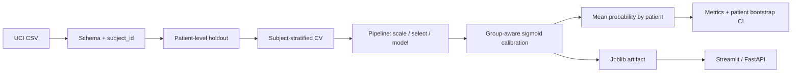

# Leakage-Aware Parkinson’s Voice Classification

Dự án phân loại Parkinson từ đặc trưng giọng nói, tập trung vào một câu hỏi quan trọng hơn Accuracy: **phép đánh giá có thực sự đo khả năng dự đoán cho bệnh nhân chưa từng gặp hay không?**

> Chỉ phục vụ nghiên cứu và học tập. Mô hình không phải thiết bị y tế, không dùng để chẩn đoán hoặc thay thế đánh giá của chuyên gia.

[](https://github.com/haminhthong/parkinsons-voice-classification/actions/workflows/ci.yml)

## Câu chuyện của dự án

Phép chia ngẫu nhiên theo từng bản ghi ban đầu đạt Accuracy **97,44%**, nhưng audit cho thấy **27/27 bệnh nhân trong test cũng xuất hiện trong train** thông qua những bản ghi giọng nói khác. Vì mỗi người có nhiều lần ghi âm, mô hình có thể học dấu hiệu riêng của người đã gặp thay vì khái quát sang bệnh nhân mới.

Repository này xây dựng lại quy trình theo đúng đơn vị độc lập:

1. Tạo bảng một dòng cho mỗi `subject_id`.
2. Chia holdout và cross-validation trên bảng bệnh nhân, có stratify theo nhãn.
3. Ánh xạ bệnh nhân train/validation trở lại toàn bộ bản ghi tương ứng.
4. Đặt `StandardScaler` và `SelectKBest` trong scikit-learn `Pipeline`.
5. Chọn mô hình bằng CV trên train; chỉ mở holdout test sau khi lựa chọn xong.
6. Báo cáo cả mức bản ghi và mức bệnh nhân, kèm độ ổn định và giới hạn dữ liệu.

Kết quả benchmark hiện tại cho thấy điểm F1-macro CV dao động đáng kể giữa fold. Đây không phải điểm yếu cần che giấu: bộ dữ liệu chỉ có 32 bệnh nhân, trong đó 8 người thuộc lớp 0. Độ bất định này đáng tin cậy hơn một Accuracy rất cao sinh ra từ phép chia rò rỉ.

## Kiến trúc đánh giá và triển khai



Không có logic preprocessing riêng trong app: notebook, CLI train, Streamlit và FastAPI đều gọi các module trong `src/`.

## Những lỗi đã sửa

| Vấn đề | Cách xử lý |
|---|---|
| Chia ngẫu nhiên 195 bản ghi | Chia trên 32 `subject_id`, sau đó ánh xạ về bản ghi |
| Validation fold có riêng lớp 1 | `StratifiedKFold` trên bảng subject và `assert y_valid.nunique() == 2` |
| ROC–AUC benchmark thành NaN | Mọi fold bắt buộc có hai lớp; benchmark dừng nếu không thể tạo fold hợp lệ |
| Repeated CV có fold mất lớp | Dùng cùng cơ chế subject-level split cho từng repeat |
| Scaler học trước khi chia | Scaler là một bước trong pipeline và chỉ fit trên train fold |
| `SVC(probability=True)` calibration theo dòng | Dùng `probability=False` và `decision_function` cho ROC–AUC benchmark |
| Xác suất chưa calibration | Sigmoid calibration với inner folds theo bệnh nhân; đánh giá bằng outer OOF folds |
| Chỉ có point estimate | Bootstrap cluster 2.000 lần ở mức bệnh nhân và báo cáo 95% CI |
| Chọn mô hình theo test | Champion được chọn bằng mean CV F1-macro trên train |

## Kết quả tái tạo hiện tại

Champion phục vụ là **KNN + sigmoid calibration**. SVM có F1-macro CV cao nhất (`0,7071`) nhưng chỉ cung cấp decision score trong protocol benchmark; KNN là mô hình có xác suất tốt nhất theo F1-macro CV (`0,6974`) và được calibration trước khi đóng gói.

| Phạm vi | F1-macro | Balanced Accuracy | ROC-AUC | Brier | ECE |
|---|---:|---:|---:|---:|---:|
| Train OOF theo bệnh nhân | 0,4286 | 0,5000 | 0,4907 | 0,1796 | 0,1293 |
| Holdout 8 bệnh nhân | 0,4286 | 0,5000 | 1,0000 | 0,1320 | 0,2894 |

Holdout có Recall `1,00` nhưng Specificity `0,00`: tại ngưỡng 0,5, mô hình dự đoán tất cả bệnh nhân là lớp 1. ROC-AUC `1,00` chỉ cho thấy thứ hạng xác suất trên **8 bệnh nhân** này; nó không biến classifier ở ngưỡng hiện tại thành mô hình tốt. Accuracy 95% CI theo patient bootstrap là `[0,375; 0,875]`. Đây là lý do repository công bố đầy đủ metric và giới hạn thay vì chọn một con số đẹp.

Nguồn chuẩn để tái tạo bảng trên là `artifacts/metrics.json`, `artifacts/model_benchmark.csv` và `artifacts/holdout_bootstrap_ci.csv`.

## Dữ liệu và schema

Bộ [UCI Parkinsons](https://archive.ics.uci.edu/dataset/174/parkinsons) có 195 bản ghi, 32 bệnh nhân, 22 đặc trưng số và nhãn `status` (`0/1`). `subject_id` được suy ra bằng cách bỏ hậu tố lần ghi khỏi `name`, ví dụ `phon_R01_S01_1 → phon_R01_S01`.

Inference yêu cầu CSV có cột `name` và đủ 22 đặc trưng gốc. Người dùng không phải nhập thủ công từng giá trị. Hai đặc trưng phụ thuộc tuyến tính (`Jitter:DDP`, `Shimmer:DDA`) được kiểm tra ở schema nhưng loại khỏi tập đặc trưng mô hình.

## Demo

Luồng xử lý:

```text
Upload CSV → kiểm tra schema → pipeline tiền xử lý → dự đoán từng bản ghi
           → trung bình xác suất theo bệnh nhân → bảng + biểu đồ + tải CSV
```

Giao diện Streamlit hiển thị:

- số bản ghi của từng bệnh nhân;
- xác suất `status = 1`;
- kết quả từng bản ghi và kết quả tổng hợp;
- biểu đồ xác suất và biểu đồ đặc trưng được chọn;
- nút tải kết quả dự đoán;
- cảnh báo giới hạn sử dụng nghiên cứu.

## Cài đặt và chạy

Yêu cầu Python 3.11.

```bash
python -m venv .venv
# Windows: .venv\Scripts\activate
# macOS/Linux: source .venv/bin/activate
pip install -r requirements.txt
python -m src.train --data data/parkinsons.csv --artifacts artifacts
streamlit run app/streamlit_app.py
```

API tùy chọn:

```bash
uvicorn app.api:app --host 0.0.0.0 --port 8000
curl -X POST -F "file=@data/parkinsons.csv" http://localhost:8000/predict
```

Docker:

```bash
docker build -t parkinsons-voice-demo .
docker run --rm -p 8501:8501 parkinsons-voice-demo
```

## Kiểm thử

```bash
pytest -q
```

Test bảo vệ các điều kiện quan trọng:

- đúng 22 đặc trưng gốc và nhãn chỉ gồm `0/1`;
- một bệnh nhân không xuất hiện đồng thời trong train/test hoặc fit/validation;
- mỗi validation fold có cả hai lớp;
- scaler chưa được fit bên ngoài pipeline;
- CSV inference thiếu cột bị từ chối;
- artifact load lại cho cùng dự đoán;
- mọi xác suất nằm trong `[0, 1]`.

## Cấu trúc repository

```text
.
├── app/                 # Streamlit và FastAPI dùng chung pipeline dự đoán
├── artifacts/           # Pipeline đã huấn luyện và bảng benchmark
├── configs/             # Protocol và seed mặc định
├── data/                # CSV cùng mô tả nguồn/schema
├── notebooks/           # Notebook thí nghiệm đã làm sạch
├── reports/figures/     # Hình xuất từ phân tích
├── src/                 # Dữ liệu, đặc trưng, train, evaluate, predict
├── tests/               # Test schema, leakage và artifact
├── .github/workflows/   # CI trên Python 3.11
├── MODEL_CARD.md        # Intended use, rủi ro và quality gates
├── Dockerfile
├── requirements.txt
└── README.md
```

## Diễn giải kết quả đúng cách

Accuracy không đủ cho dữ liệu lệch lớp. Benchmark báo cáo F1-macro, Balanced Accuracy và ROC–AUC; phân tích cuối cần xem thêm Recall/Sensitivity và Specificity. Xác suất bệnh nhân là trung bình xác suất của các bản ghi thuộc cùng `subject_id`, với ngưỡng cố định 0,5.

Bootstrap phải resample theo bệnh nhân, không theo bản ghi. Khoảng tin cậy có thể rộng vì holdout chỉ có hai bệnh nhân lớp 0. Kết quả không chứng minh quan hệ nhân quả giữa đặc trưng giọng nói và bệnh, cũng không thay thế validation trên cohort độc lập.

## Tái lập và hướng phát triển

Seed mặc định là `42`; phiên bản thư viện được khóa trong `requirements.txt`; artifact lưu cả pipeline lẫn metadata đặc trưng, ngưỡng, calibration và holdout. External validation vẫn chưa có và là bước quan trọng nhất tiếp theo. Không nên tối ưu thêm trên holdout hiện tại rồi tiếp tục gọi đó là test độc lập.

## Bullet CV và câu chuyện phỏng vấn

- Audit mô hình Parkinson Voice đạt Accuracy 97,44% và phát hiện 27/27 bệnh nhân test bị trùng với train qua các bản ghi khác; thiết kế lại holdout và cross-validation theo `subject_id`.
- Benchmark 6 mô hình bằng pipeline không leakage, thêm nested group-aware probability calibration, Brier/ECE và patient-cluster bootstrap CI; bảo vệ protocol bằng 15 automated tests và GitHub Actions.
- Đóng gói cùng một calibrated pipeline cho CLI, Streamlit, FastAPI và Docker, kèm model card nêu rõ intended use, external-validation gap và giới hạn fairness.

Câu chuyện ngắn: **điểm cao bất thường → audit đơn vị độc lập → phát hiện leakage → thiết kế lại protocol → hiệu năng giảm nhưng đáng tin hơn → đóng gói quality gates để lỗi không quay lại.**
