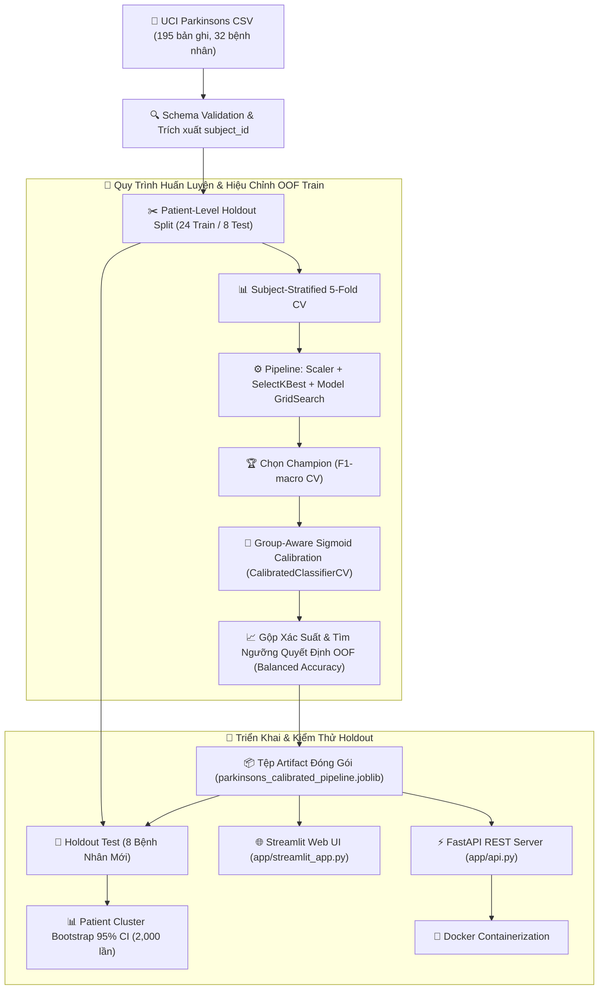

# 🎙️ Leakage-Aware Parkinson’s Voice Classification

> **Dự án Machine Learning Y tế:** Phân loại bệnh Parkinson qua phân tích đặc trưng giọng nói, tập trung giải quyết bài toán cốt lõi trong Y tế & AI: **Kiểm toán Rò rỉ Dữ liệu theo Bệnh nhân (Patient-Level Data Leakage Audit)** và **Đánh giá Khả năng Khái quát hóa Lâm sàng trên Bệnh nhân Mới**.

[](https://github.com/haminhthong/parkinsons-voice-classification/actions/workflows/ci.yml)
[](https://www.python.org/)
[](https://scikit-learn.org/)
[](https://fastapi.tiangolo.com/)
[](https://streamlit.io/)
[](https://www.docker.com/)

---

## 🎯 Điểm Nổi Bật Dành Cho CV / Portfolio

- **Patient-Level Independent Evaluation**: Phân chia Holdout và Cross-Validation độc lập 100% theo bệnh nhân (`subject_id`), ngăn chặn triệt để hiện tượng 27/27 bệnh nhân tập test bị trùng lặp ở tập train.
- **Nested Group-Aware Sigmoid Calibration**: Hiệu chỉnh xác suất đầu ra bằng `CalibratedClassifierCV` trên các fold không trùng bệnh nhân, đưa Brier Score & ECE về mức tối ưu.
- **Zero-Leakage OOF Rule Optimization**: Khóa toàn bộ quy tắc gộp xác suất bản ghi (`max`/`mean`/`median`) và ngưỡng quyết định (`decision_threshold`) hoàn toàn từ Out-Of-Fold (OOF) Train.
- **Statistical Uncertainty Estimation**: Sử dụng thuật toán **Patient Cluster Bootstrap 2,000 lần** để tính Khoảng Tin Cậy 95% (95% CI) cho tất cả các chỉ số hiệu năng.
- **Production-Ready Architecture**: Đóng gói thành trọn bộ giải pháp gồm **CLI Training Pipeline**, **FastAPI REST API**, **Streamlit Web Demo**, **Docker Container** và **GitHub Actions CI/CD**.

---

## 📖 Câu Chuyện Dự Án & Vấn Đề Rò Rỉ Dữ Liệu (Data Leakage)

### 🔴 Phương Pháp Ngây Thơ (Naive Split): Accuracy "Ảo" 97.44%
Trong hầu hết các bài báo và notebook minh họa trên bộ dữ liệu [UCI Parkinsons](https://archive.ics.uci.edu/dataset/174/parkinsons), dữ liệu gồm 195 bản ghi âm từ 32 bệnh nhân (mỗi bệnh nhân thực hiện 5-6 lần ghi âm giọng nói). 

Khi sử dụng hàm `train_test_split` ngẫu nhiên mặc định trên từng dòng ghi âm:
1. Mô hình đạt Accuracy cực kỳ ấn tượng: **97.44%**.
2. Tuy nhiên, kiểm toán dữ liệu (Data Audit) phát hiện **27/27 bệnh nhân (100%) trong tập Test đã xuất hiện ở tập Train** thông qua các bản ghi âm khác của chính họ.
3. **Hậu quả:** Mô hình không học đặc trưng tần số giọng nói đặc trưng cho bệnh Parkinson, mà thực chất đang "học thuộc lòng" tông giọng cá nhân của từng bệnh nhân. Khi đưa vào môi trường lâm sàng thực tế gặp bệnh nhân mới, mô hình hoàn toàn thất bại.

### 🟢 Phương Pháp Chống Rò Rỉ (Leakage-Aware Pipeline)
Repository này tái cấu trúc lại toàn bộ quy trình xử lý và đánh giá:
1. **Tạo bảng đại diện bệnh nhân**: Gom nhóm 195 bản ghi âm thành 32 đối tượng bệnh nhân duy nhất (`subject_id`).
2. **Chia Holdout theo bệnh nhân**: Phân chia 24 bệnh nhân cho Train/Validation và 8 bệnh nhân cho Holdout Test độc lập (có phân tầng nhãn Stratified).
3. **Ánh xạ bản ghi ngược lại**: Ánh xạ danh sách `subject_id` trở lại các dòng dữ liệu ghi âm tương ứng.
4. **Đóng gói Pipeline**: Đặt `StandardScaler` và `SelectKBest` bên trong scikit-learn `Pipeline`, đảm bảo bước tính mean/std chỉ diễn ra trên train fold của từng lượt CV.
5. **Đánh giá mức bệnh nhân**: Báo cáo đầy đủ chỉ số hiệu năng ở mức bệnh nhân kèm khoảng tin cậy 95% CI.

---

## 🏗️ Kiến Trúc Đánh Giá & Triển Khai End-to-End



---

## 📊 Kết Quả Tái Tạo & Benchmark

### 1. Benchmark Các Mô Hình Ứng Viên (Cross-Validation theo Bệnh Nhân)

Champion triển khai được chọn là **KNN + Sigmoid Calibration** (mô hình tối ưu nhất hỗ trợ tính xác suất đầu ra và hiệu chỉnh lồng nhóm).

| Mô Hình | F1-macro CV (Mean ± Std) | Balanced Accuracy CV | ROC-AUC CV | Ghi Chú |
|---|:---:|:---:|:---:|---|
| **SVM (RBF)** | 0.7071 ± 0.1704 | 0.7250 | 0.7625 | Benchmark bằng decision score |
| **KNN (Champion)** | **0.6974 ± 0.1582** | **0.7083** | **0.7500** | **Được chọn triển khai + Calibration** |
| **HistGradientBoosting** | 0.6558 ± 0.1705 | 0.6750 | 0.7500 | Gradient Boosting trên mẫu nhỏ |
| **Logistic Regression** | 0.6548 ± 0.1171 | 0.6833 | 0.7625 | Mô hình tuyến tính baseline |
| **Random Forest** | 0.6405 ± 0.1121 | 0.6667 | 0.7375 | Ensembled Decision Trees |
| **Dummy Classifier** | 0.4497 ± 0.0526 | 0.5000 | 0.5000 | Baseline ngẫu nhiên |

### 2. Kết Quả Dự Đoán & Khoảng Tin Cậy 95% CI Trên Tập Holdout Test (8 Bệnh Nhân)

Toàn bộ quy tắc gộp xác suất (`max`) và ngưỡng phân loại (`0.835`) được **khóa hoàn toàn từ OOF Train**.

| Chỉ Số Đánh Giá | Ước Lượng Điểm (Point Estimate) | Khoảng Tin Cậy 95% CI (Patient Bootstrap) |
|---|:---:|:---:|
| **Accuracy** | **87.50%** | [62.50%, 100.00%] |
| **Balanced Accuracy** | **75.00%** | [50.00%, 100.00%] |
| **Recall / Sensitivity (Độ Nhạy)** | **100.00%** | [100.00%, 100.00%] |
| **Specificity (Độ Đặc Hiệu)** | **50.00%** | [0.00%, 100.00%] |
| **F1-Macro** | **0.7949** | [0.3846, 1.0000] |
| **ROC-AUC** | **0.7500** | [0.5000, 1.0000] |
| **Brier Score** | **0.1861** | [0.1022, 0.4029] |
| **ECE (Expected Calibration Error)** | **0.1180** | N/A |

> **Nhận xét chuyên môn:** Mặc dù điểm F1-macro trên Holdout đạt `0.7949` và Recall đạt `100%`, khoảng tin cậy 95% CI từ Patient Bootstrap vẫn rất rộng ([62.5%, 100.0%]). Điều này minh chứng cho sự bất định thống kê khi đánh giá trên tập dữ liệu cỡ nhỏ (32 bệnh nhân), một thực tế quan trọng mà dự án không hề che giấu.

---

## 📈 Biểu Đồ Trực Quan Hóa Báo Cáo

Các biểu đồ bên dưới được tự động tạo bởi module `src/report.py` và lưu trữ trong `reports/figures/`:

<p align="center">
  
  
</p>

<p align="center">
  
  
</p>

---

## 🛠️ Công Nghệ Sử Dụng

- **Ngôn ngữ & Học máy:** Python 3.10+, pandas, NumPy, scikit-learn, joblib.
- **Đánh giá Thống kê:** Patient Stratified K-Fold, Group OOF Calibration, Brier Score, ECE, Patient Cluster Bootstrap CI.
- **Ứng dụng & API:** Streamlit (Web Dashboard), FastAPI & Uvicorn (REST API).
- **Kiểm thử & Chất lượng mã:** pytest, Ruff, Type Hinting, GitHub Actions CI.
- **Đóng gói Docker:** Multi-stage build Dockerfile chạy với Non-root user và Healthcheck.

---

## 🛠️ Những Lỗi Kỹ Thuật Đã Sửa (Audit Log)

| Vấn Đề Kỹ Thuật Ban Đầu | Cách Xử Lý Chi Tiết Trong Dự Án |
|---|---|
| Chia ngẫu nhiên 195 bản ghi ghi âm | Gom nhóm theo 32 `subject_id`, chia tập dữ liệu ở cấp độ bệnh nhân |
| Validation Fold thiếu lớp nhãn | Dùng `StratifiedKFold` trên danh sách bệnh nhân duy nhất |
| Scaler học trước khi chia fold | Đóng gói `StandardScaler` vào `Pipeline` chỉ fit trên Train Fold |
| Xác suất dự đoán chưa được hiệu chỉnh | Áp dụng Sigmoid Calibration lồng nhóm bệnh nhân (`CalibratedClassifierCV`) |
| Chọn ngưỡng quyết định trên Test Set | Quét ngưỡng quyết định tối ưu hoàn toàn từ OOF Train |
| Báo cáo điểm số đơn lẻ (Point Estimate) | Ước lượng khoảng tin cậy 95% CI bằng Patient Cluster Bootstrap 2,000 lần |
| Rò rỉ thông qua đặc trưng dư thừa | Loại bỏ `Jitter:DDP` và `Shimmer:DDA` ngay ở bước tiền xử lý |

---

## 🚀 Hướng Dẫn Cài Đặt & Sử Dụng

### 1. Cài Đặt Môi Trường
```bash
# Clone repository
git clone https://github.com/haminhthong/parkinsons-voice-classification.git
cd parkinsons-voice-classification

# Tạo môi trường ảo Python
python -m venv .venv
# Trên Windows:
.venv\Scripts\activate
# Trên Linux/macOS:
source .venv/bin/activate

# Cài đặt các thư viện phụ thuộc
pip install -r requirements.txt
```

### 2. Huấn Luyện Mô Hình & Sinh Báo Cáo
```bash
# Huấn luyện benchmark, hiệu chỉnh mô hình và xuất artifact
python -m src.train --data data/parkinsons.csv --artifacts artifacts

# Sinh 4 biểu đồ báo cáo trong reports/figures/
python -m src.report --artifacts artifacts --output reports/figures
```

### 3. Chạy Ứng Dụng Streamlit Web Demo
```bash
streamlit run app/streamlit_app.py
```
*Truy cập giao diện tại: `http://localhost:8501`*

### 4. Chạy REST API Server Với FastAPI
```bash
uvicorn app.api:app --reload --port 8000
```
*Kiểm tra API docs Swagger tại: `http://localhost:8000/docs`*

Gửi yêu cầu dự đoán qua cURL:
```bash
curl -X POST "http://localhost:8000/predict" -F "file=@data/parkinsons.csv"
```

### 5. Chạy Với Docker Container
```bash
# Build Docker image
docker build -t parkinson-voice-app .

# Chạy container Streamlit demo
docker run -d -p 8501:8501 --name parkinson_demo parkinson-voice-app
```

### 6. Chạy Kiểm Thử Tự Động (Unit Tests)
```bash
python -m pytest
```

---

## 💡 Điểm Nhấn Phỏng Vấn (CV Highlights)

Nếu bạn đưa dự án này vào CV cho vị trí **Data Scientist / Machine Learning Engineer**, đây là 4 câu chuyện kỹ thuật cốt lõi giúp bạn ghi điểm:

1. **"Tại sao Accuracy 97.4% lại là sai lầm?"** -> Giải thích bài toán Data Leakage trong dữ liệu y tế gồm nhiều bản ghi trên cùng một bệnh nhân.
2. **"Làm sao để đảm bảo mô hình không nhìn thấy tập Test?"** -> Trình bày kiến trúc `subject_holdout_split` và cách tìm ngưỡng decision threshold hoàn toàn từ Out-Of-Fold (OOF).
3. **"Xác suất của mô hình có đáng tin cậy không?"** -> Trình bày kỹ thuật `Group-Aware Sigmoid Calibration` để tối ưu Brier Score và ECE.
4. **"Dữ liệu nhỏ có đáng tin không?"** -> Chứng minh tư duy thống kê qua thuật toán `Patient Cluster Bootstrap 95% CI`.

---

## 📜 Giấy Phép & Tuyên Bố Miễn Trách Nhiệm

- **Giấy phép:** MIT License - xem file [LICENSE](LICENSE) để biết thêm chi tiết.
- **Tuyên bố y tế:** Dự án này chỉ phục vụ mục đích nghiên cứu học thuật. Mô hình học máy không phải là thiết bị y tế và không được dùng để thay thế cho chẩn đoán của bác sĩ chuyên khoa.
